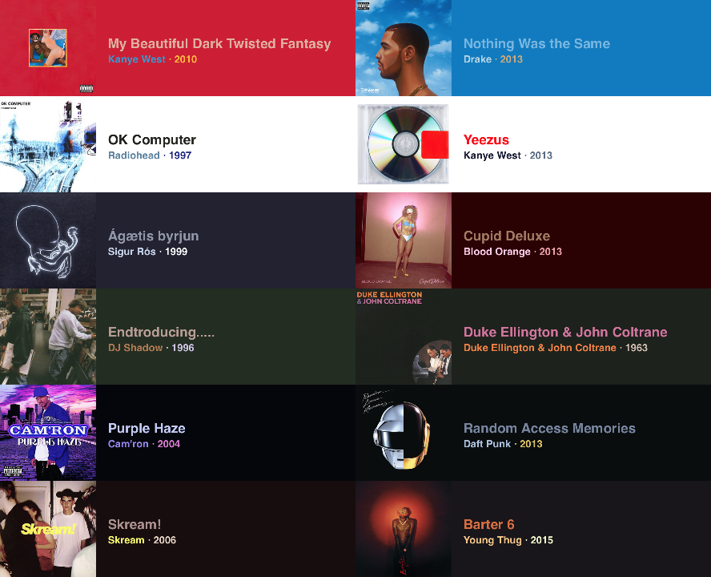

# NSImageColors

iTunes style color fetcher for NSImage. This is based on [Panic's OS X ColorArt](https://github.com/panicinc/ColorArt/) for iOS Swift.

In other words, it fetches the most dominant and prominent colors.



## Example

Asynchronous example:

```swift
let image = NSImage(named: "yeezus.png")

image.getColors { colors in
  backgroundView.backgroundColor = colors.background
  mainLabel.textColor = colors.primary
  secondaryLabel.textColor = colors.secondary
  detailLabel.textColor = colors.detail
}
```

Synchronous example:

```swift
let colors = NSImage(named: "yeezus.png").colors

backgroundView.backgroundColor = colors.background
mainLabel.textColor = colors.primary
secondaryLabel.textColor = colors.secondary
detailLabel.textColor = colors.detail
```

## NSImage Methods

```swift
getColors() -> NSImageColors
```

Returns a `NSImageColors` object. The sample image is rescaled to a width of 250px and the aspect ratio height. This blocks the main thread.

```swift
getColors(scaleDownSize: CGSize) -> NSImageColors
```

Returns a `NSImageColors` object with a custom image rescale. Use smaller sizes for better performance at the cost of quality colors. Use larger sizes for better color sampling and quality at the cost of performance. This blocks the main thread.

```swift
getColors(completionHandler: (NSImageColors) -> Void) -> Void
```

Passes a `NSImageColors` object into the closure. The sample image is rescaled to a width of 250px and the aspect ratio height. This runs on the background thread.

```swift
getColors(scaleDownSize: CGSize, completionHandler: (NSImageColors) -> Void) -> Void
```

Passes a `NSImageColors` object into the closure, with a custom image rescale. Use smaller sizes for better performance at the cost of quality colors. Use larger sizes for better color sampling and quality at the cost of performance. This runs on the background thread.

## NSImageColors

`NSImageColors` is struct that contains four different `NSColor`s.

```swift
var background
var primary
var secondary
var detail
```

## License

The [license](https://github.com/jathu/NSImageColors/blob/master/LICENSE) is provided in the project folder. Please also refer to Panic's [original license](https://github.com/panicinc/ColorArt/#license).

------
June 2015 - Toronto
